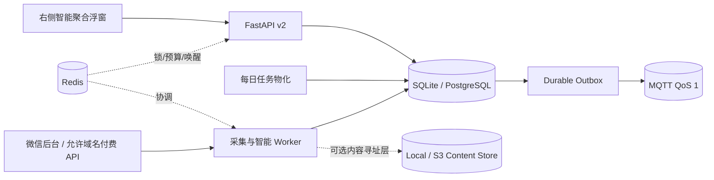

# Intelligence Hub v3

Intelligence Hub 是 `we-mp-rss` 的增量智能聚合层。它复用现有文章、公众号授权和登录体系，
新增工作区隔离、主题分析、反馈学习、日期日报、单篇导出以及可恢复的采集任务。旧 v1 API 和页面
仍保留；新能力集中在全局右侧浮窗，不增加一组独立管理页面。

当前需求、研究、迁移和验证入口见[文档索引](README.md)。旧 `wechat-download-api` 的功能不会整体
复制；每项采用状态见[原始需求与实现调研迁移矩阵](migrations/wechat-download-api.md)。
数据库事实、环境路线和 SQL/迁移交接统一进入 [AI-DB 工作区](../vibe/ai-db/README.md)；该目录只是
文档与记忆，不保存凭据，也不授权 Agent 执行数据库写操作。

> 当前代码和离线迁移工具已经交付，但默认不开启后台任务和真实采集。执行现有数据库迁移、写入
> 凭据、启用微信或付费接口、启动 Redis/MQTT、部署服务仍需单独确认。

## 架构档位

[v3 七批整改](tasks/260824-wechat-intelligence-hub/plan.md#active-v3-remediation)已完成本地代码和离线验证：
独立采集检查点、日报覆盖/迟到修订、统一偏好排序、本地正文、单一阅读浮窗和离线连接器均有回归。
真实数据库、供应商、基础设施联调和用户体验未验收。一次测试误导入旧队列导致 Redis 连接，后续
已改为网络守卫隔离测试；之前的 Redis 状态影响尚未核验，见[事件记录](tasks/260824-wechat-intelligence-hub/verify.md#v3-test-isolation-incident)。

| 档位 | 权威事务存储 | 协调层 | 事件传输 | 正文/导出存储 | 适用范围 |
| --- | --- | --- | --- | --- | --- |
| Lite | SQLite + WAL | 数据库轮询/进程内 | 无 | 本地内容寻址能力 | 单机、离线、迁移验证 |
| Standard | PostgreSQL | Redis | DB outbox + Redis 唤醒 | 本地或 S3/MinIO 能力 | 推荐生产档位 |
| Distributed | PostgreSQL | Redis | MQTT QoS 1 + DB outbox 重放 | S3/MinIO 能力 | 多采集节点、跨网络投递 |

PostgreSQL/SQLite 中的任务、游标、反馈和 outbox 是最终事实。Redis 只保存可重建的缓存、锁、
令牌桶和唤醒信号；MQTT 只发送紧凑事件信封，不发送文章正文。Redis 已配置但不可用时，采集预算
故障关闭；MQTT 失败时事件留在 outbox 中按租约重试。
未配置外部投递时，空 Publisher 不领取事件，也不将事件伪记为 delivered；本地保留 pending。
过期租约不能确认成功或覆写重试状态。历史 delivered 记录未做数据修复，不能单独作为真实投递凭证。



## 数据与租户边界

- `articles` 保持全局去重；`int_workspace_articles` 决定工作区能否看到文章。
- 订阅、文章主题关联、分析、用户阅读状态、反馈、偏好、日报和分享链接均带工作区边界。
- 列表、日报和公开分享不返回正文；详情和单篇下载必须先通过工作区成员校验。
- 打开浮窗不自动关联历史文章（包括管理员）。管理员必须勾选确认，每次显式关联最多 200 篇；
  API 允许单批 1..500 篇，不自动继续。订阅选择本地已解析来源，暂停不撤销当日固定来源或在途任务。
- 同一公众号的公开文章实体可在订阅它的工作区之间复用；阅读、收藏、反馈、偏好和日报不共享。
- 采集页携带正文时，先写 SHA-256 对象，再在页面事务登记 `int_article_content_blobs` 引用；多个
  文章可复用同一对象。详情/下载校验大小与哈希，失败时回退已有 legacy 正文或明确显示不可用。
  为保持 v1 兼容，正文列仍保留；既有数据搬迁/清理是独立门禁。元数据刷新不会擦除已有正文。
- 微信列表适配器不补抓正文；详情和下载也不隐式补抓。没有已存正文时导出明确标记“仅元数据”。
- 手动 Feed 导入目前只允许管理员明确确认的公开内容：v2 关联隔离不等于旧 v1 全局文章池已完成
  多租户化。私密 Feed 不可导入；文件中的脚本、主动元素与远程媒体被去除。`connector:` 文章
  被旧版补抓队列和强制刷新排除，不能通过后续 repair 路径变成隐藏抓取。

## 采集、限频与替代提供方

浮窗只有一个视图状态：宽屏列表与阅读并排，窄窗在同层切换，返回时恢复标题焦点；没有阅读二级弹窗。
筛选、日期和宽度按用户/工作区保存，正文、反馈草稿与分享密钥不写入浏览器偏好。旧请求不能覆盖
新筛选、文章、日期或账号。正文在去除主动导航元素的隔离 iframe 中展示，远程图片/媒体默认不加载。
日报临时筛选不改写版本快照或分享内容；学习使用全部反馈，建议需批准，已批准规则可撤销。
状态/类型/构建测试不替代真实焦点、键盘、视口和触感验收；这些浏览器门禁仍未运行。

现有 `we-mp-rss` 适配器复用后台 `token`、`cookie` 和公众号 `faker_id`，每次 Worker 执行只调用一次
`appmsgpublish` 列表接口、只取一页、不跟随重定向、不在适配器内部重试或抓正文。结果全部落库后
才在同一事务中提交文章、工作区可见性、检查点、分析任务和 outbox；租约过期禁止整批写入。

每日 `head` 从首页开始，遇到上次头部边界或列表结束停止；每个任务默认最多 3 页，每页分开入队。
首次只有窗口样本或预算耗尽时保留 `partial` 和原因，不能当作全历史同步完成。已有完整边界不会
被截断任务覆盖；独立 `backfill` 检查点只服务显式历史回填，不影响次日首页轮询。

Lite 和 PostgreSQL 都使用持久化的提供方/账号/来源预算，默认最小间隔分别为 6/30/30 秒。
这只是工程保守策略，不是微信官方额度或避限保证。Redis 是额外闸门，本地等待不扣供应商失败次数。

所有工作区实际共享的 `we-mp-rss` 凭据归并为同一个采集账户和总限频预算。同一来源每天只物化
一个采集任务，落库后再向所有订阅工作区扇出文章关联和分析任务，避免按用户重复请求微信。
这种扇出仅适用于显式全局共享账号；工作区私有账号只向其所属工作区入库。

状态机为 `healthy → cooldown → probe → healthy`；认证失效进入 `disabled`。`Retry-After` 优先，
否则按 15、30、60、120、240、360 分钟退避。`200013` 视为限频，`200003` 视为认证失效，
两者不会混为同一种重试。

`PaidJsonApiCollectorAdapter` 提供付费/充值 API 的安全接入契约：仅 HTTPS、主机允许名单、Bearer
密钥引用、5 MiB 响应上限、禁止重定向、单页调用和统一游标。它尚未绑定某个供应商或运行时密钥；
正式启用前需要独立评审供应商合同、价格、字段映射、预算和密钥存储。

## 外部连接器扩展

后续 RSS 服务、托管聚合、付费 API、AI 增强和投递平台统一通过
[连接器注册表](integrations/README.md)接入。连接器按发现、导入、订阅同步、搜索、增强、投递和
状态同步声明能力，并从 `researched` 逐级提升到 `accepted`；营销页或一次成功调用不能跳过契约、
测试账号、数据库和运行时验收。

SupSub 是首个样板连接器：供应商状态仍为 `researched`，本地已实现通用 Feed 文件解析和 CLI 参数/
JSON 信封契约，不代表真实字段、账号和服务已接通。它不替代 `we-mp-rss`，也未写入默认配置。
订阅/分组外部写入、整源不可逆已读、按次额度和公开不可撤销分享不能由定时任务自动执行。详细
限制见 [SupSub 服务与连接器核验](research/supsub-integration.md)。

运行状态浮窗已显示采集/工作队列、账号冷却、检查点版本、近期日报覆盖、用量单位和能力核验状态。
这些是本地数据库投影；“已配置”不表示连通或运行正常，接口不会探测 Redis/MQTT/供应商。

- RSS/Atom/JSON Feed 可从本地 UTF-8 文件预览；单批最多 1 MiB、100 篇，发布时间必须带时区，
  缺失时间保留为空，不推断为今日。OPML 展示分组并去重，但隐藏带密钥 URL，不自动添加订阅。
- 管理员可把公开 Feed 文件导入本工作区；规范身份、用量收据、分析/日报协调任务在同一事务写入。
  重复请求幂等，不覆盖已有规范正文/标题/反馈，不跨工作区复用未知来源；重导入不承担更新同步。
- 目前只接收文件内容，不抓取 Feed URL、不执行 CLI。Wechat2RSS 仅格式预览，禁止导入/运行绑定。
- 单位账本默认每日 500 单位、计费关闭；unknown/reserved 不自动重试或切换供应商。它不是余额、
  价格或付费供应商的真实额度承诺。安装、凭据引用、远端游标和供应商验收收据仍待后续接入。
- SupSub 只读计划固定 JSON 输出、禁自更新；读取内容显式 `--all` 避免默认仅未读。`mp.search`
  会创建异步任务，不在只读允许名单中；精读、已读、分享、订阅/分组写入一律拒绝。

## 日报与反馈学习

- Asia/Shanghai 06:30 采集，07:50 截止，08:00 生成日报。
- 每个日期覆盖“前一日 07:50（不含）到当日 07:50（含）”的连续 24 小时，文章不会因午夜
  切窗而遗漏。
- 每日任务首次物化时冻结应采来源清单，之后暂停/新增订阅不改写该日范围。08:00 前拒绝发布；
  到点若尚有待采集、页预算不足、失败、未配置或待分析内容，发布 `partial` 并保留原因与覆盖数。
- 页面落库和分析结果会原子入队日报协调任务；迟到文章按原发布时间归入对应日期，不以固定 7 天
  回看窗口丢弃旧日期补录。相同输入生成是无操作；新输入增加不可变修订快照和版本化 outbox。
- 日报按日期归档，可生成有效期 1 小时至 90 天的分享链接；数据库只保存 token 哈希。链接跟随
  最新修订、可由创建人撤销；公开页面显示完成度、修订号和迟到标记，不泄露正文/个人反馈。
- 明确的有用/不感兴趣反馈立即覆盖有效相关度；收藏是独立状态，不等同于点赞。
- 收件箱和日报使用同一 SQL 排序/主题过滤契约，默认相关度优先，可切换最新优先；单篇明确反馈
  优先于规则和收藏加分。分页游标绑定筛选条件，没有“只看前 500 篇”的候选截断。
- 所有反馈以不可变事件保存并可分页查看。规则提议使用全部历史，不截断为最近 90 天；至少覆盖
  20 篇不同文章且跨 7 天后，才从结构化反馈提出来源、主题或摘要长度规则。规则需批准，支持版本化
  撤销；自动折叠不能隐藏/删除文章，也不能覆盖明确反馈。自由文本留作证据，不自动推断强动作。
- 单篇主题纠正立即覆盖该用户的过滤与排序，不改写其他用户的主题。个人保存筛选支持工作区隔离、
  同名更新和删除；列表与日报修订共用个人偏好。
- 已持久化正文支持 SQLite FTS5 trigram 检索；PostgreSQL 使用 simple 全文 GIN（英文词语），中文
  和短查询使用字面 LIKE 回退。旧正文无索引时可只读回退，不因搜索执行迁移或联网。
- Markdown 下载转换标题、列表和强调结构，HTML/PDF/DOCX 仅转换已存内容；图片不在服务端远程补全。
- AI CLI 默认关闭。未启用或调用失败时使用确定性本地主题规则；Codex、Claude、Grok、Cursor
  适配器使用临时最小输入、严格 JSON 结构、超时和无工具模式。

## API 与交互

认证 API 前缀为 `/api/v2/intelligence`，提供工作区初始化、文章列表/详情/主题过滤、单篇
MD/HTML/JSON/PDF/DOCX 下载、反馈、分析、公众号画像、订阅、偏好建议、日期日报和分享。公开
日报页面为 `/share/digest/{token}`，使用转义、CSP、无引用来源和过期校验。

前端没有增加导航路由。登录后的基础布局始终显示一个 `AI 聚合` 浮动按钮，右侧抽屉包含：

1. 今日收件箱：搜索、主题、状态和最低相关度过滤；
2. 日期汇总：日期选择、归档、重新生成和分享；
3. 偏好学习：生成、批准或拒绝规则；
4. 运行状态：不联网的任务/覆盖投影、订阅管理、能力核验状态与手动公开 Feed 文件导入。

## 旧行为收敛状态

| 能力 | 当前状态 | 收敛方向 |
| --- | --- | --- |
| RSS/Atom/JSON/Markdown Feed | v1 已存在 | 保留现有实现；后续补工作区过滤、稳定增量游标和租户鉴权。 |
| 单篇下载 | v2 已实现 | 保持 MD/HTML/JSON/PDF/DOCX 与工作区校验。 |
| 整号/批量导出 | 核心已有五格式异步 ZIP，属于部分实现 | 在当前 exporter 上补日期/时间窗/增量、HTML/EPUB、审计和默认不触发上游的不变量。 |
| 通知与图片代理 | 核心已存在 | 复用现有通知、允许名单与代理路径；不建立第二套旧项目实现。 |
| MCP | 计划中 | 当前核心没有 MCP 运行入口；未来按工作区/Access Key 授权，不能按旧单用户边界宣传。 |

Feed、摘要和导出默认只读已经持久化的可见文章，不得隐式触发微信或付费供应商调用。若某种离线
格式需要远程补全图片，UI/API 必须显式展示网络请求、预算、缓存和降级行为。

## 配置与安全启动

环境变量优先于 `config.yaml`。关键配置如下：

| 配置 | 默认值 | 说明 |
| --- | --- | --- |
| `STORAGE_PROFILE` | `lite` | `lite`、`standard` 或 `distributed` |
| `DB` | `sqlite:///./data/db.db` | Standard/Distributed 必须是 PostgreSQL URL |
| `REDIS_URL` | 空/配置回退 | Standard/Distributed 必填 |
| `MQTT_URL` | 空 | 仅 Distributed 必填，支持 `mqtt://`/`mqtts://` |
| `CONTENT_BACKEND` | `local` | `local` 或 `s3` |
| `CONTENT_ROOT` | `./data/content` | 本地内容寻址根目录 |
| `S3_BUCKET` / `S3_ENDPOINT_URL` | 空 | S3/MinIO 配置 |
| `PUBLIC_BASE_URL` | 空 | 分享链接绝对地址；空值返回相对地址 |
| `AI_CLI_ENABLED` | 空 | 逗号分隔且显式启用的 AI CLI |
| `INTELLIGENCE_ENABLED` | `False` | 迁移完成后才开启任务物化/Worker |
| `INTELLIGENCE_COLLECTOR_ENABLED` | `False` | 独立授权真实微信采集 |

`compose/docker-compose.intelligence.yaml` 提供 PostgreSQL 16、Redis 7、内部 Mosquitto 2 和应用
的 Distributed 示例。数据库、Redis 和 MQTT 不发布宿主端口；MQTT 允许匿名仅限 Compose 内部
网络。跨主机部署必须改为 TLS 和认证。PostgreSQL 密码进入 URL 前需要 URL 编码。

## 迁移和验收边界

V3 使用冻结的 Alembic 版本链 `int_v2_20260824 → int_v3_20260830`。连接初始化不再自动补列；显式
旧版初始化仅建 legacy 表，不能代替 intelligence 迁移。Worker 检查结构、唯一性与已应用版本。
普通非唯一索引缺失只作为性能提示。SQLite 检查使用只读文件模式，不会创建缺失数据库文件。
详见 [v3 数据库交接](../vibe/ai-db/ai-db-tasks/260830/0941-intelligence-v3/sql.md)。

离线版本迁移 SQL（仅生成；新 schema 用 base，已核验 v2 用 `--from-revision int_v2_20260824`）：

```bash
python tools/intelligence_schema.py upgrade-sql --dialect postgresql
```

只读检查现有数据库：

```bash
python tools/intelligence_schema.py inspect --database-url sqlite:///data/db.db
```

离线生成待评审 DDL，不会连接数据库：

```bash
python tools/intelligence_schema.py ddl --dialect postgresql
```

检查结果会列出缺失/意外表和列，但不会输出连接 URL。实际 DDL、`-init True`、数据回填或
PostgreSQL 切换都属于数据库写操作，必须先备份并由用户/DBA 单独批准。代码验证不能替代真实
数据库、Redis/MQTT、微信授权、浏览器、部署或生产验收。新的 DB 调研、schema 核验或迁移候选
必须从 [AI-DB 任务规则](../vibe/ai-db/ai-db-tasks/rules.md)创建独立交接包。

本地回归使用 `tools/test_intelligence_offline.py`，在发现测试前阻断 socket、子进程和非临时 SQLite。
前端构建后用 `tools/sync_intelligence_ui.cjs --sync` 从干净的 `static` 目录增量同步，`--check` 校验；
不运行会安装依赖并清空目录的旧构建脚本，不删除旧哈希资源。本次校验 129 个构建文件和 15 个首页
本地引用；未启动服务或浏览器，未执行部署。

采集原理、已核验限制、付费 API 与开源边界见
[微信公众号采集路线与开源边界](research/wechat-collection-landscape.md)。
