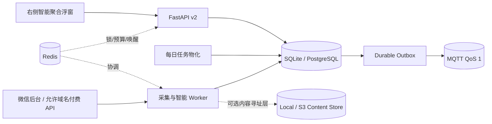

# Intelligence Hub v2

Intelligence Hub 是 `we-mp-rss` 的增量智能聚合层。它复用现有文章、公众号授权和登录体系，
新增工作区隔离、主题分析、反馈学习、日期日报、单篇导出以及可恢复的采集任务。旧 v1 API 和页面
仍保留；新能力集中在全局右侧浮窗，不增加一组独立管理页面。

当前需求、研究、迁移和验证入口见[文档索引](README.md)。旧 `wechat-download-api` 的功能不会整体
复制；每项采用状态见[原始需求与实现调研迁移矩阵](migrations/wechat-download-api.md)。

> 当前代码和离线迁移工具已经交付，但默认不开启后台任务和真实采集。执行现有数据库迁移、写入
> 凭据、启用微信或付费接口、启动 Redis/MQTT、部署服务仍需单独确认。

## 架构档位

| 档位 | 权威事务存储 | 协调层 | 事件传输 | 正文/导出存储 | 适用范围 |
| --- | --- | --- | --- | --- | --- |
| Lite | SQLite + WAL | 数据库轮询/进程内 | 无 | 本地内容寻址能力 | 单机、离线、迁移验证 |
| Standard | PostgreSQL | Redis | DB outbox + Redis 唤醒 | 本地或 S3/MinIO 能力 | 推荐生产档位 |
| Distributed | PostgreSQL | Redis | MQTT QoS 1 + DB outbox 重放 | S3/MinIO 能力 | 多采集节点、跨网络投递 |

PostgreSQL/SQLite 中的任务、游标、反馈和 outbox 是最终事实。Redis 只保存可重建的缓存、锁、
令牌桶和唤醒信号；MQTT 只发送紧凑事件信封，不发送文章正文。Redis 已配置但不可用时，采集预算
故障关闭；MQTT 失败时事件留在 outbox 中按租约重试。



## 数据与租户边界

- `articles` 保持全局去重；`int_workspace_articles` 决定工作区能否看到文章。
- 订阅、文章主题关联、分析、用户阅读状态、反馈、偏好、日报和分享链接均带工作区边界。
- 列表、日报和公开分享不返回正文；详情和单篇下载必须先通过工作区成员校验。
- 旧版全局文章只能由管理员显式回填。普通用户首次打开浮窗只创建空的个人工作区。
- 同一公众号的公开文章实体可在订阅它的工作区之间复用；阅读、收藏、反馈、偏好和日报不共享。
- 内容寻址 Local/S3 适配器和 `int_article_content_blobs` 指针表已经提供；为保持 v1 兼容，当前
  `articles` 正文列尚未自动搬离数据库，实际对象迁移仍是独立数据门禁。

## 采集、限频与替代提供方

现有 `we-mp-rss` 适配器复用后台 `token`、`cookie` 和公众号 `faker_id`，每个任务只调用一次
`appmsgpublish` 列表接口、只取一页、不跟随重定向、不在适配器内部重试或抓正文。结果全部落库后
才推进持久游标。

所有工作区实际共享的 `we-mp-rss` 凭据归并为同一个采集账户和总限频预算。同一来源每天只物化
一个采集任务，落库后再向所有订阅工作区扇出文章关联和分析任务，避免按用户重复请求微信。

状态机为 `healthy → cooldown → probe → healthy`；认证失效进入 `disabled`。`Retry-After` 优先，
否则按 15、30、60、120、240、360 分钟退避。`200013` 视为限频，`200003` 视为认证失效，
两者不会混为同一种重试。

`PaidJsonApiCollectorAdapter` 提供付费/充值 API 的安全接入契约：仅 HTTPS、主机允许名单、Bearer
密钥引用、5 MiB 响应上限、禁止重定向、单页调用和统一游标。它尚未绑定某个供应商或运行时密钥；
正式启用前需要独立评审供应商合同、价格、字段映射、预算和密钥存储。

## 外部连接器扩展

后续 RSS 服务、托管聚合、付费 API、AI 增强和投递平台统一通过
[连接器注册表](integrations/README.md)接入。连接器按发现、导入、订阅同步、搜索、增强、投递和
状态同步声明能力，并从 `researched` 逐级提升到 `accepted`；营销页或一次成功调用不能跳过契约、
测试账号、数据库和运行时验收。

SupSub 是首个样板连接器，当前只完成公开证据和采用设计：可考虑 RSS/Atom/JSON Feed 入站/出站、
OPML 一次性迁移、CLI 只读发现和额度确认后的精读增强。它不替代 `we-mp-rss`，也未写入默认配置。
订阅/分组外部写入、整源不可逆已读、按次额度和公开不可撤销分享不能由定时任务自动执行。详细
限制见 [SupSub 服务与连接器核验](research/supsub-integration.md)。

未来浮窗增加“连接器中心”时，应展示能力、来源映射、最近验证时间、套餐/额度、同步方向、游标、
错误和降级状态；所有 R2 以上操作先生成变更预览。该界面和持久化模型属于后续实现要求，不在
当前 v2 已完成代码中。

## 日报与反馈学习

- Asia/Shanghai 06:30 采集，07:50 截止，08:00 生成日报。
- 每个日期覆盖“前一日 07:50（不含）到当日 07:50（含）”的连续 24 小时，文章不会因午夜
  切窗而遗漏。
- 日报按日期归档，可生成有效期 1 小时至 90 天的分享链接；数据库只保存 token 哈希。
- 明确的有用/不感兴趣反馈立即覆盖有效相关度；收藏是独立状态，不等同于点赞。
- 所有反馈以不可变事件保存。至少覆盖 20 篇不同文章且跨 7 天后，系统才提出来源偏好规则；规则
  必须由用户批准后才生效，不会静默删除文章。
- AI CLI 默认关闭。未启用或调用失败时使用确定性本地主题规则；Codex、Claude、Grok、Cursor
  适配器使用临时最小输入、严格 JSON 结构、超时和无工具模式。

## API 与交互

认证 API 前缀为 `/api/v2/intelligence`，提供工作区初始化、文章列表/详情/主题过滤、单篇
MD/HTML/JSON/PDF/DOCX 下载、反馈、分析、公众号画像、订阅、偏好建议、日期日报和分享。公开
日报页面为 `/share/digest/{token}`，使用转义、CSP、无引用来源和过期校验。

前端没有增加导航路由。登录后的基础布局始终显示一个 `AI 聚合` 浮动按钮，右侧抽屉包含：

1. 今日收件箱：搜索、主题、状态和最低相关度过滤；
2. 日期汇总：日期选择、归档、重新生成和分享；
3. 偏好学习：生成、批准或拒绝规则；
4. 运行状态：无密钥基础设施诊断和订阅入口。

## 旧行为收敛状态

| 能力 | 当前状态 | 收敛方向 |
| --- | --- | --- |
| RSS/Atom/JSON/Markdown Feed | v1 已存在 | 保留现有实现；后续补工作区过滤、稳定增量游标和租户鉴权。 |
| 单篇下载 | v2 已实现 | 保持 MD/HTML/JSON/PDF/DOCX 与工作区校验。 |
| 整号/批量导出 | 核心已有五格式异步 ZIP，属于部分实现 | 在当前 exporter 上补日期/时间窗/增量、HTML/EPUB、审计和默认不触发上游的不变量。 |
| 通知与图片代理 | 核心已存在 | 复用现有通知、允许名单与代理路径；不建立第二套旧项目实现。 |
| MCP | 计划中 | 当前核心没有 MCP 运行入口；未来按工作区/Access Key 授权，不能按旧单用户边界宣传。 |

Feed、摘要和导出默认只读已经持久化的可见文章，不得隐式触发微信或付费供应商调用。若某种离线
格式需要远程补全图片，UI/API 必须显式展示网络请求、预算、缓存和降级行为。

## 配置与安全启动

环境变量优先于 `config.yaml`。关键配置如下：

| 配置 | 默认值 | 说明 |
| --- | --- | --- |
| `STORAGE_PROFILE` | `lite` | `lite`、`standard` 或 `distributed` |
| `DB` | `sqlite:///./data/db.db` | Standard/Distributed 必须是 PostgreSQL URL |
| `REDIS_URL` | 空/配置回退 | Standard/Distributed 必填 |
| `MQTT_URL` | 空 | 仅 Distributed 必填，支持 `mqtt://`/`mqtts://` |
| `CONTENT_BACKEND` | `local` | `local` 或 `s3` |
| `CONTENT_ROOT` | `./data/content` | 本地内容寻址根目录 |
| `S3_BUCKET` / `S3_ENDPOINT_URL` | 空 | S3/MinIO 配置 |
| `PUBLIC_BASE_URL` | 空 | 分享链接绝对地址；空值返回相对地址 |
| `AI_CLI_ENABLED` | 空 | 逗号分隔且显式启用的 AI CLI |
| `INTELLIGENCE_ENABLED` | `False` | 迁移完成后才开启任务物化/Worker |
| `INTELLIGENCE_COLLECTOR_ENABLED` | `False` | 独立授权真实微信采集 |

`compose/docker-compose.intelligence.yaml` 提供 PostgreSQL 16、Redis 7、内部 Mosquitto 2 和应用
的 Distributed 示例。数据库、Redis 和 MQTT 不发布宿主端口；MQTT 允许匿名仅限 Compose 内部
网络。跨主机部署必须改为 TLS 和认证。PostgreSQL 密码进入 URL 前需要 URL 编码。

## 迁移和验收边界

只读检查现有数据库：

```bash
python tools/intelligence_schema.py inspect --database-url sqlite:///data/db.db
```

离线生成待评审 DDL，不会连接数据库：

```bash
python tools/intelligence_schema.py ddl --dialect postgresql
```

检查结果会列出缺失/意外表和列，但不会输出连接 URL。实际 DDL、`-init True`、数据回填或
PostgreSQL 切换都属于数据库写操作，必须先备份并由用户/DBA 单独批准。代码验证不能替代真实
数据库、Redis/MQTT、微信授权、浏览器、部署或生产验收。

采集原理、已核验限制、付费 API 与开源边界见
[微信公众号采集路线与开源边界](research/wechat-collection-landscape.md)。
